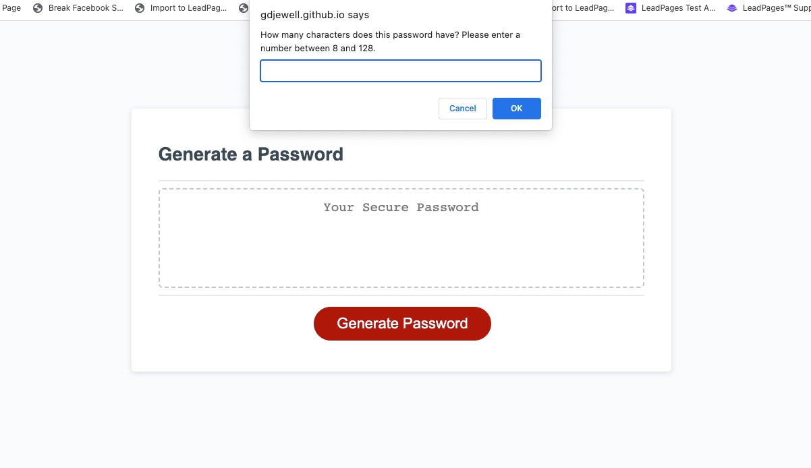

# Password Generator JavaScript Challenge

## Description

This is a general password generator that prompts for what type of password the user is looking for, and a password will be chosen at random and display on the screen.  This project was done for the 3rd assignment as an intro to JavaScript. 

## Usage

1. Press the 'Generate Password' button.
2. Enter the number of characters that you would like between 8 and 128.
3. Enter whether you want uppercase letters in your password.
4. Enter whether you'd like lowercase letters in your password.
5. Enter if you want special characters in the password.
6. Finally, enter if you want numbers.

## Features

Generates a password using a random number generator that then selects from a list of available password characters based upon user input. The character selections are uppercase lettres, lowercase letters, numbers, and special characters.

## Screenshots

